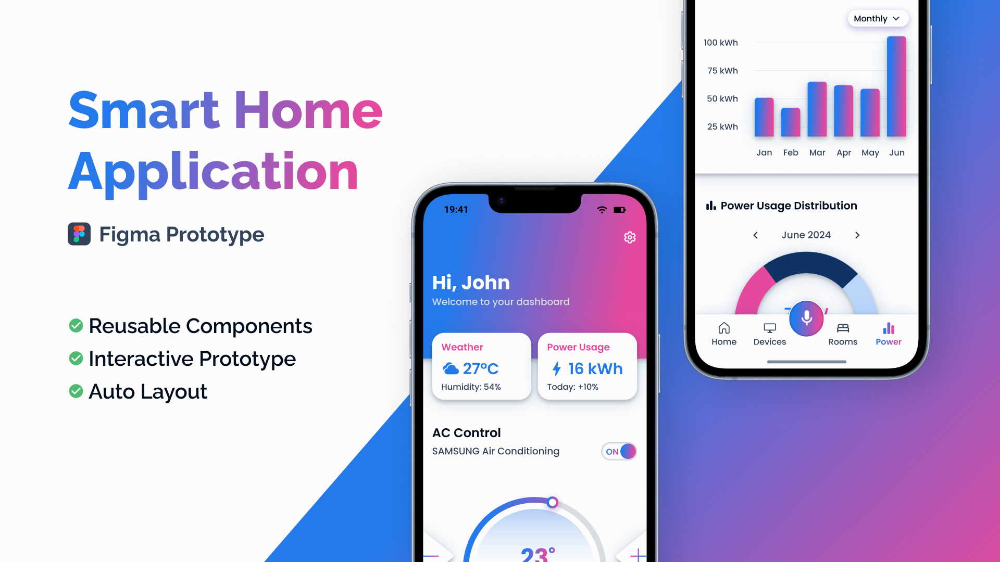

# Smart Home App – Figma Prototype

This project is a **personal UI/UX mobile application design** aimed at learning and practicing **Figma**. It features a **functional high-fidelity prototype** of a mobile smart home application.  
The goal was to create a clean and intuitive interface for controlling smart devices in a household environment, while becoming familiar with design workflows and tools.

### Figma Prototype
[View the project on Figma](https://www.figma.com/design/G5TvNg51GrRBOPfCtaYcnk/Smart-Home-App?node-id=182-2636&t=IY0jikxaqDBylNKw-1)

### Project Highlights

- High-fidelity mobile interface
- Use of Figma Auto-Layout
- Modular design system with reusable components
- Interactive prototype with transitions
- Consistent visual style, typography, and color palette
