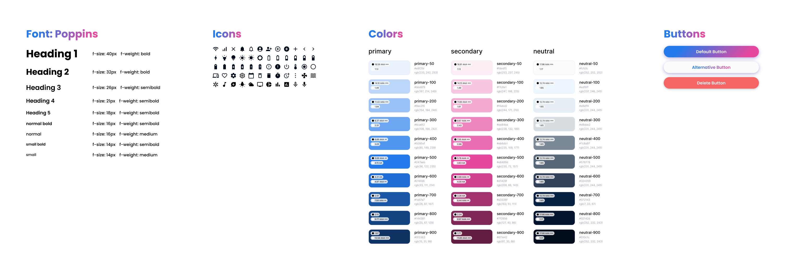
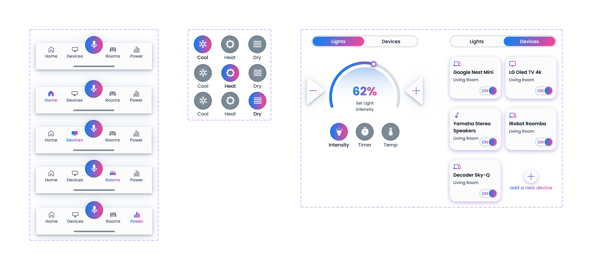
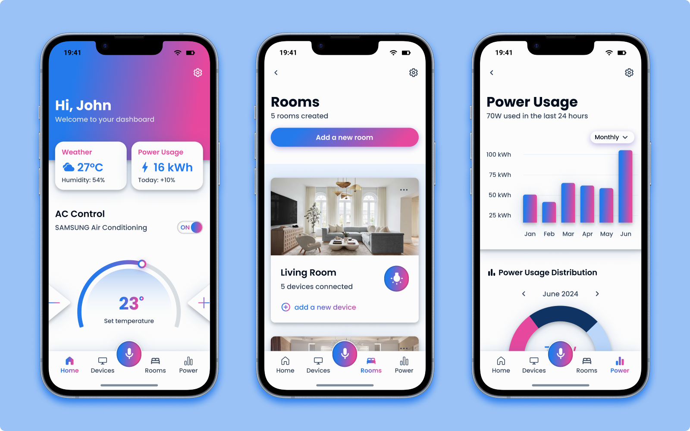

# Design Process – Smart Home App Prototype

The objective was to design a complete smart home app prototype to explore and understand how to use **Figma** for professional UI design.  
This included mastering components, prototyping features, and organizing a scalable design system.

---

### Phase 1 – Design System

The project began with the creation of a foundational **design system** to ensure consistency and scalability throughout the prototype. This system included:

- A **typographic scale** for headings, body text, and labels
- A **color palette** focused on contrast, clarity, and visual harmony (with dark mode support)
- Defined **spacing units** and a **8pt grid** for layout alignment
- **Style tokens** using Figma's color and text styles
- Basic shapes and icons to guide the visual language

This phase was essential for maintaining visual consistency across all UI elements.

---

### Phase 2 – Wireframe

Before designing the final interface, a set of **low-fidelity wireframes** was created to define the structure and flow of the app. These wireframes focused on:

- Core user flows (e.g., login → dashboard → device control)
- Layouts for each screen without distractions from visuals
- Navigation patterns and screen hierarchy

This helped iterate quickly on layout decisions and ensured that all key features were addressed before moving into detailed design.

---

### Phase 3 – Components

Once the structure was clear, reusable **UI components** were built to speed up the design process and ensure uniformity. Components included:

- Buttons (primary, secondary, icon-only)
- Inputs (text fields, toggles, sliders)
- Cards for devices and rooms
- Navigation bars and tab menus
- Modal dialogs and alert toasts

Variants and auto-layout were used extensively to handle different states (e.g., active/inactive, loading).

---

### Phase 4 – UI Screens

With the design system and components in place, high-fidelity UI screens were created to visualize the final app. These screens included:

- **Home Dashboard**: overview of all rooms and devices
- **Room View**: detailed control over devices in a specific room
- **Device Control**: individual control panels (e.g., lights, thermostat, security cameras)
- **User Flows**: login, signup, onboarding, and settings

The UI focused on **clarity**, **ease of interaction**, and **modern smart home aesthetics**.

---

### Phase 5 – Prototyping & Interactions

The final phase involved turning static screens into an **interactive prototype**. Figma's prototyping tools were used to simulate app behavior, including:

- Screen-to-screen navigation
- Microinteractions on toggles, buttons, and sliders
- Transitions between states using Smart Animate
- Simulated login flow and contextual screen feedback

This made the prototype functional and ready for demonstration or usability testing.
