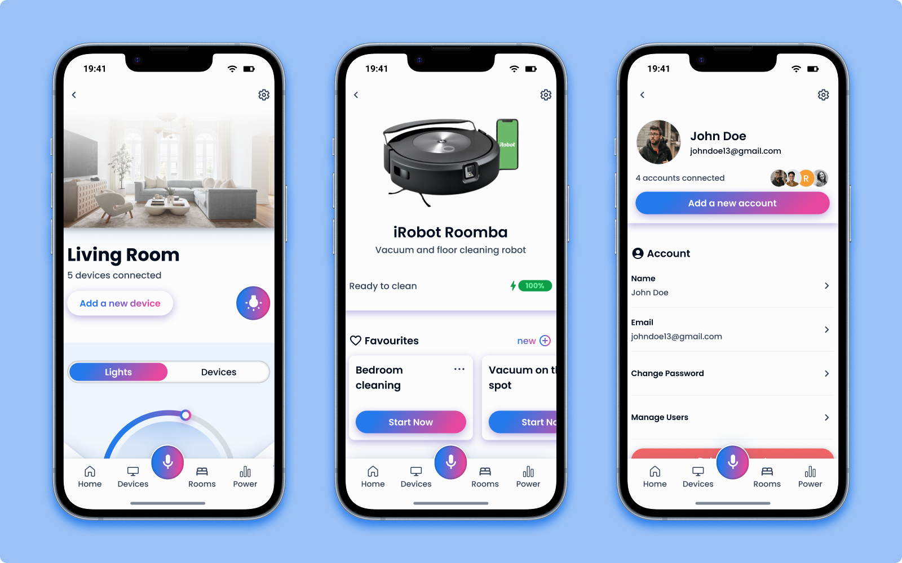

# Design Process – Smart Home App Prototype

The objective was to design a complete smart home app prototype to explore and understand how to use **Figma** for professional UI design.  
This included mastering components, prototyping features, and organizing a scalable design system.

[View the project on Figma](https://www.figma.com/design/G5TvNg51GrRBOPfCtaYcnk/Smart-Home-App?node-id=182-2636&t=IY0jikxaqDBylNKw-1)

---

### Phase 1 – Design System

The project began with the creation of a foundational **design system** to ensure consistency and scalability throughout the prototype. This system included:

- A **typographic scale** for headings, body text, labels...
- A **color palette** using Figma variables
- Defined **spacing units** and a **grid layout** for alignment
- **Style variables** using Figma's color and text styles
- Basic **buttons and icons** to guide the visual language

This phase was essential for maintaining visual consistency across all UI elements.

---

### Phase 2 – Wireframe

Before designing the final interface, a set of **low-fidelity wireframes** was created to define the structure and flow of the app. These wireframes focused on:

- User flows
- Organization of information and content of the app
- Layouts for each screen without distractions from visuals
- Navigation patterns and information hierarchy

This helped iterate quickly on layout decisions and ensured that all key features were included before moving into detailed design.

---

### Phase 3 – Components

Once the structure was clear, reusable **UI components** were built to speed up the design process and ensure uniformity. Components included:

- Buttons (primary, secondary, icon-only)
- Inputs (text fields, toggles, sliders)
- Cards for devices and rooms
- Navigation bars and tab menus
- Modal dialogs and toggles

Variants and auto-layout were used to handle different states (active/inactive, loading, ...).

---

### Phase 4 – UI Screens

With the design system and components in place, **high-fidelity UI screens** were created to visualize the final app. These screens included:

- **Home Dashboard**: overview of all rooms and devices
- **Rooms**: overview of all the rooms in the household
- **Devices**: overview of all the connected devices
- **Power Usage**: visualizations of the energy consumption of the house
- **Single Room**: information and devices of a specific room
- **Single Device**: information and settings of a specific device
- **Settings**: login, signup and settings

---

### Phase 5 – Prototyping & Interactions

The final phase involved turning static screens into an **interactive prototype**. Figma's prototyping tools were used to simulate app behavior, including:

- Screen-to-screen navigation
- Microinteractions on toggles, buttons, and sliders
- Transitions between states

This made the prototype functional and ready for demonstration or usability testing.
